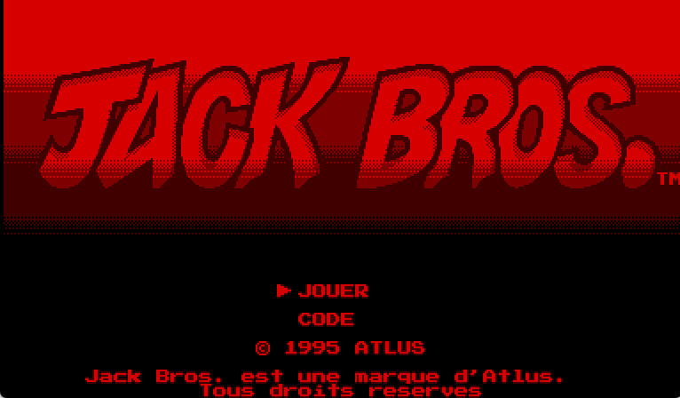
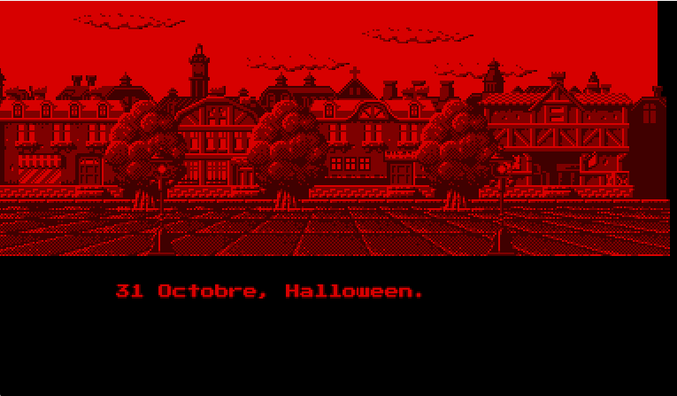
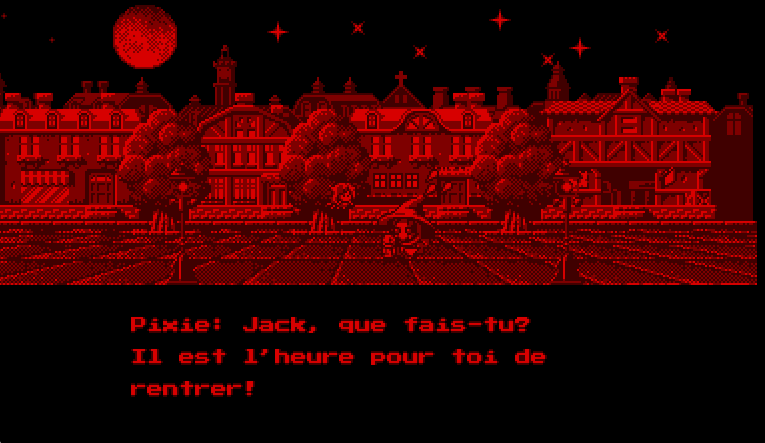
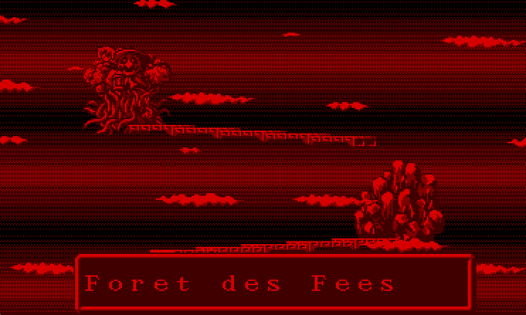
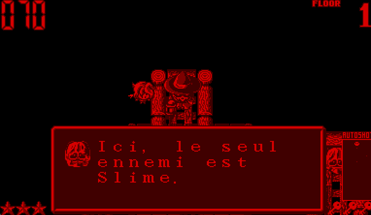

<div align="center">

# Jack Bros. (Virtual Boy) - Patch Français

**Traduction française intégrale de *Jack Bros.* sur Nintendo Virtual Boy (Atlus, 1995)**

<br/>

<a href="https://fr.wikipedia.org/wiki/Virtual_Boy"></a>


<a href="https://github.com/chenetulipe/JackBros-FR-VB/releases"></a>
<a href="LICENSE"></a>

<br/><br/>

Premier spin-off officiel de la série *Megami Tensei*, mettant en vedette Jack Frost, Jack Lantern et Jack Skelton.  
Le jeu est désormais entièrement jouable en français.

</div>

<br/>

---

## Présentation

Sorti à l'automne 1995 par **Atlus**, *Jack Bros.* est l'un des rares jeux d'action en vue du dessus du Virtual Boy. 

Les trois frères Jack ont profité d'Halloween pour visiter le monde des humains. Le problème : ils ont jusqu'à minuit pour retrouver le portail féerique, sans quoi ils resteront bloqués pour toujours. Guidés par la fée Pixie, ils doivent traverser 6 mondes remplis de pièges, d'ennemis et de boss.

Le jeu n'était sorti qu'au Japon et aux États-Unis. Ce patch traduit l'ensemble des textes en français : cinématiques, dialogues des boss, indices des fées et menus.

<br/>

---

## Captures d'écran

<br/>

| Écran-titre | Introduction |
|:---:|:---:|
|  |  |

<br/>

| Dialogue avec Pixie | Monde 1 (Forêt des Fées) |
|:---:|:---:|
|  |  |

<br/>

| Indice de jeu (Clés) | Astuce en donjon (Slime) |
|:---:|:---:|
|  |  |

<br/>

---

## Comment appliquer le patch

Pour des raisons légales, **aucune ROM n'est distribuée dans ce dépôt**.  
Vous devez fournir votre propre dump de la ROM américaine d'origine.

<br/>

### Empreintes de la ROM originale attendue :
- **Fichier** : `Jack Bros. (USA).vb` (ou `Jack Bros (U) [!].vb`)
- **Taille** : `1 048 576 octets` (1.00 Mo)
- **CRC32** : `A44DE03C`
- **MD5** : `EE873C9969C15E92CA9A0F689C4CE5EA`
- **SHA-1** : `0E086D7EF2BD8B97315196943FD0B71DA07AA8F1`

<br/>

### Méthode 1 : Avec le Patcher Web inclus (recommandé)

Le dépôt intègre un patcher web local basé sur WebAssembly (xdelta3) :

1. Téléchargez le patch `Jack Bros. (USA) [T-Fr v1.0 chenetulipe].xdelta` depuis l'onglet **[Releases](https://github.com/chenetulipe/JackBros-FR-VB/releases)**.
2. Double-cliquez sur `patcher/lancer_patcher.bat`.
3. Votre navigateur s'ouvre automatiquement sur le patcher local.
4. Glissez votre ROM et le patch `.xdelta`, puis cliquez sur **Patcher**.
5. Votre ROM traduite `Jack Bros (Fr).vb` est prête instantanément.

Vous pouvez également utiliser un patcher en ligne standard comme [Marc Robledo Rom Patcher JS](https://www.marcrobledo.com/RomPatcher.js/).

<br/>

### Méthode 2 : Avec l'outil de romhacking (Tool)

Si vous souhaitez inspecter les dialogues en JSON ou recompiler la ROM depuis les sources :

1. Double-cliquez sur `start.bat` à la racine.
2. Glissez votre ROM `Jack Bros. (USA).vb` dans l'interface web.
3. Cliquez sur **Compiler la ROM**.

<br/>

> [!TIP]
> En cas de problème ou de bug textuel en jeu, n'hésitez pas à ouvrir une **[Issue](https://github.com/chenetulipe/JackBros-FR-VB/issues)** sur le dépôt.

<br/>

---

## Comment jouer

La ROM patchée fonctionne sur l'ensemble des émulateurs actuels et sur console d'origine :

- **Sur PC** : [Mednafen](https://mednafen.github.io/) (recommandé pour sa grande fidélité) ou [RetroArch](https://www.retroarch.com/) avec le core [Beetle VB](https://docs.libretro.com/library/beetle_vb/).
- **Sur Nintendo 3DS** : avec l'émulateur homebrew [Red-Viper](https://github.com/Floogle/red-viper) (qui exploite l'écran 3D stéréoscopique de la console).
- **En Réalité Virtuelle** : via [Virtual Boy Go](https://github.com/skyfloogle/virtualboygo) (Meta Quest / PCVR).
- **Sur vraie console Virtual Boy** : compatible sur le matériel d'origine via cartouche flash ([FlashBoy Plus](https://www.planetvb.com/), Virtual Boy Pro).

<br/>

---

## Contenu du projet

```text
JackBros-FR-VB/
├── start.bat                  # Lanceur de l'outil de traduction local
├── LICENSE                    # Licence GNU General Public License v3.0
├── README.md                  # Présentation du projet
├── DOCUMENTATION.md           # Notes techniques sur la ROM et l'architecture
├── CREDITS.md                 # Remerciements et crédits
├── assets/screenshots/        # Captures d'écran du jeu en français
├── patcher/                   # Patcher web local en HTML / WebAssembly (xdelta3)
│   ├── index.html
│   └── lancer_patcher.bat
├── traduction/
│   └── JackBros_FR.json       # Les 142 textes traduits en français
└── tool/                      # Moteur de compilation et interface web locale
```

<br/>

---

## Crédits & Remerciements

- Projet réalisé par **[chenetulipe](https://github.com/chenetulipe)**.
- Merci à **Atlus** pour le jeu d'origine (1995).
- Retrouvez l'ensemble des crédits et des sources dans **[CREDITS.md](./CREDITS.md)**.

<br/>

---

## Mentions Légales

Ce projet est un travail de traduction bénévole et indépendant réalisé par des fans.  
Il n'est ni affilié, ni approuvé par Nintendo ou Atlus.  
Jack Bros., Shin Megami Tensei et leurs personnages sont la propriété d'**Atlus Co., Ltd. / SEGA**.
